# MarvelPedia
website is live at: https://somya-pradhan.github.io/MarvelPedia/

# Project Brief
The MarvelPedia is a solo project, a web-based application designed for Marvel enthusiasts to explore detailed information about various Marvel characters and create a personalized list of their favourites. This project aims to provide an engaging and interactive platform for users to dive into the Marvel universe, learn about their favourite characters, and keep track of their top picks.

# Features
**1. Dark Mode Toggle:**
- A dark mode button allows users to switch between light and dark themes for a comfortable viewing experience.

**2. Responsive Dropdown Menu:**
- A dropdown menu containing all page links appears on smaller screens, ensuring easy navigation on all devices.

**3. Home Page:**
- Fetch and display detailed information about Marvel characters using the Marvel API.
- Display character profiles with images, background details, and more.
- Showcase a wide list of superheroes with individual cards.
- Each superhero card includes:

  - Add to Favourite button: Adds the superhero to the user's favourite list.
  - While attempting to add a superhero/character already in the favourites list, it alerts the user with a popup message stating that the superhero/character is already added to their favourites.
  - Details button: Opens a new page with extensive details about the character.

**4. Search Functionality:**
- A search bar enables users to find specific superheroes by typing their names.
- If no superhero is found, a message "No superhero found" is displayed.

**5. Favourite Superheros/Characters Page:**
- Displays a list of superheroes added to the favourites.
- Each favourite superhero card includes:

  - Remove from List button: Removes the superhero from the favourite list.
  - Details button: Functions similarly to the home page, opening a detailed character page.

# Technologies Used:

- **Frontend:** `HTML, CSS, Bootstap & JavaScript`
- **API:** `Marvel API` for fetching character details.
- **Icons:**  `FontAwesome` to bring a stylish and intuitive visual experience.

# Project Gallery:

**01. Home Page in Light Mode** 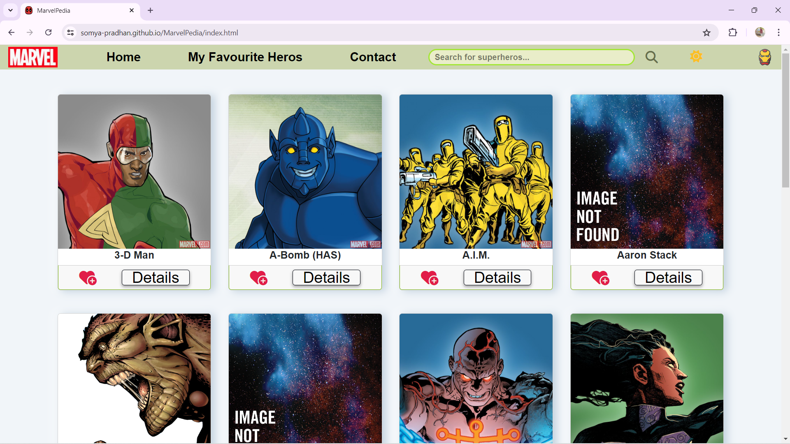

**02. Home Page in Dark Mode** 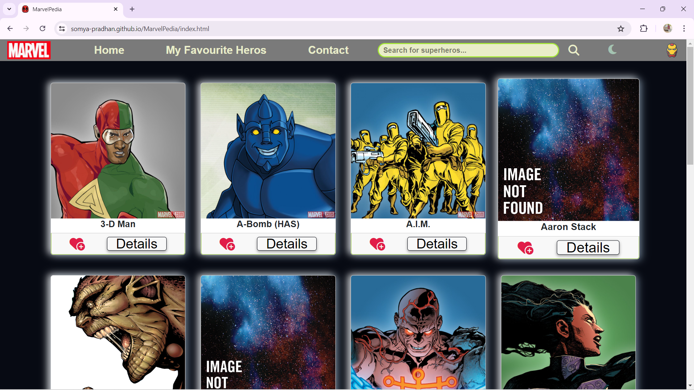

**03. Home Page: search functionality displays a `No superhero found` message in light mode** 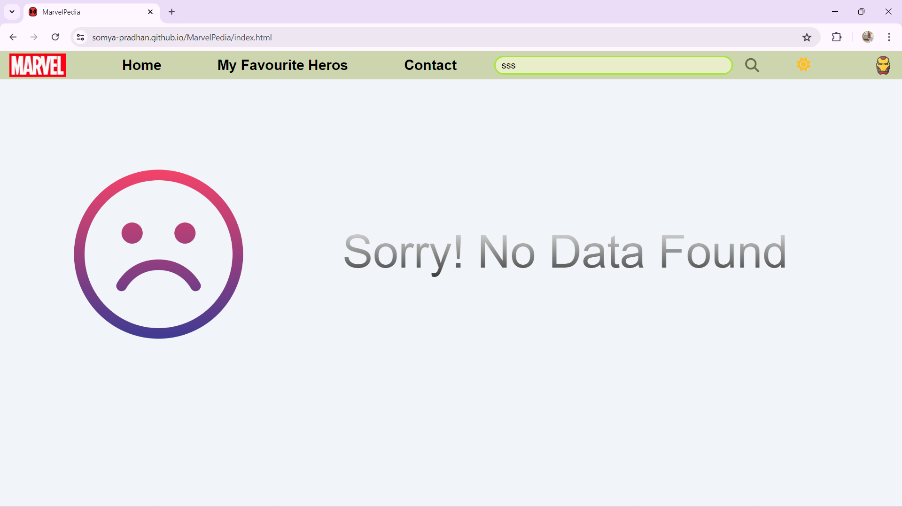 

**04. Home Page: search functionality displays a `No superhero found` message in dark mode** 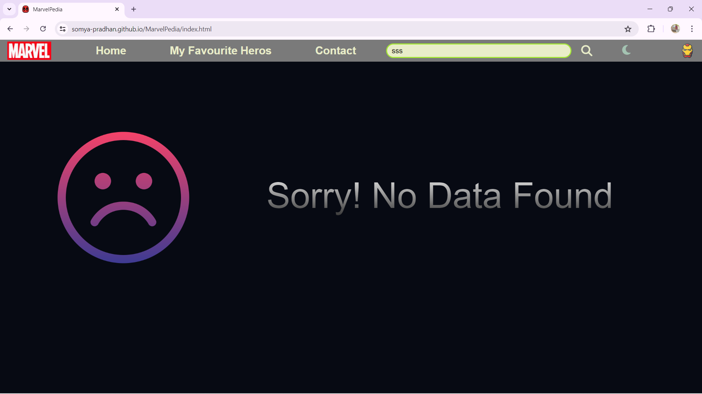
 
**05. About Page in Light Mode** 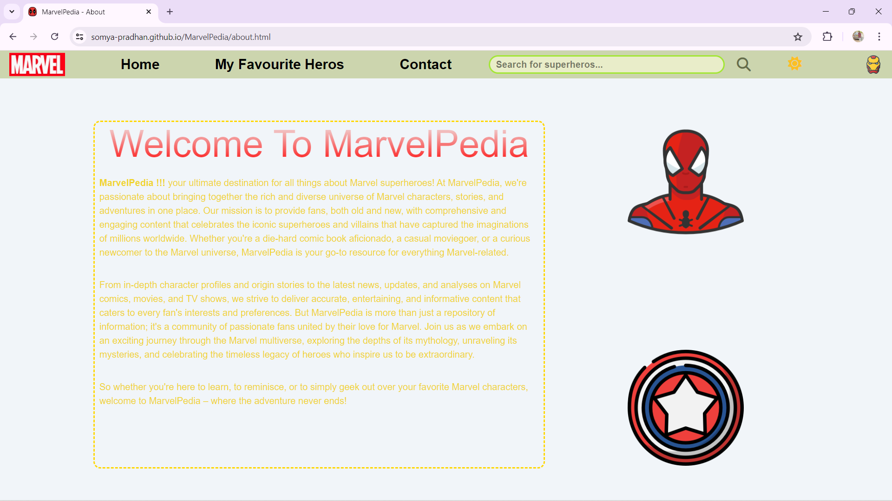

**06. About Page in Dark Mode** 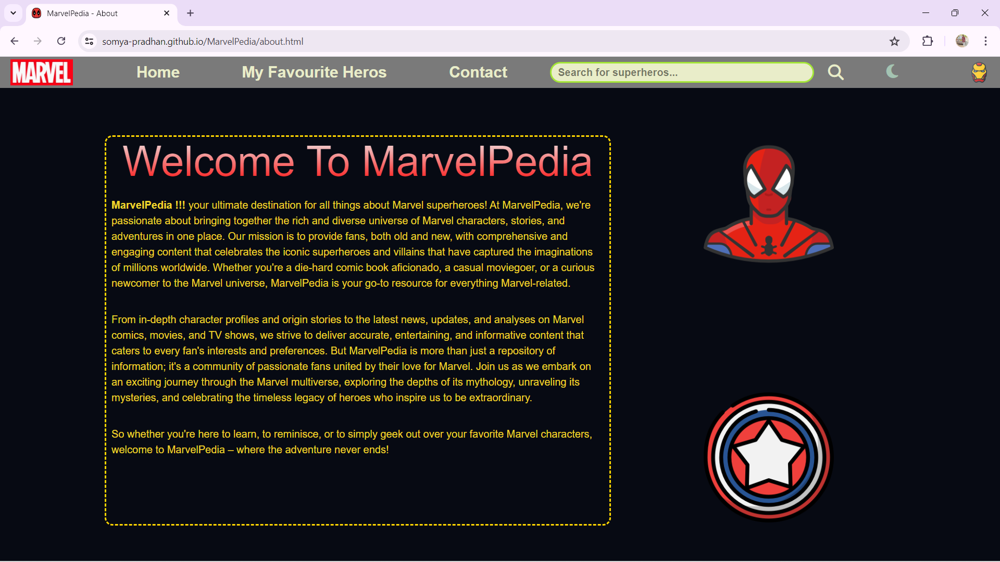

**07. Dropdown Menu in Light Mode** 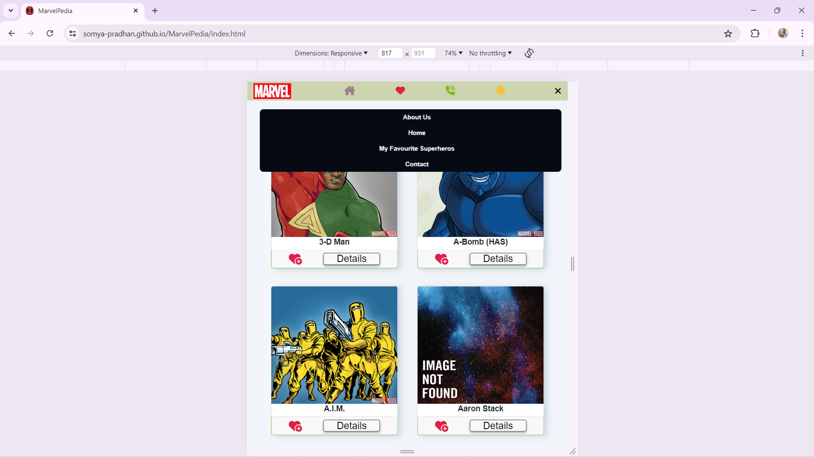

**08. Dropdown Menu in Dark Mode** 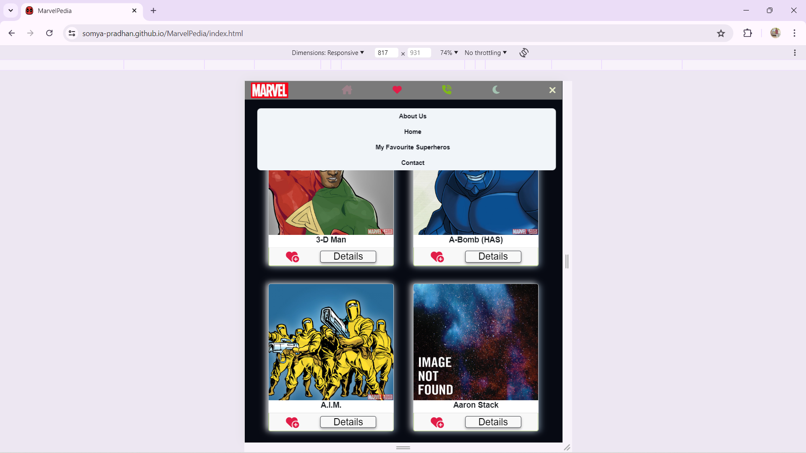

**09. Superhero/Character Details Page** 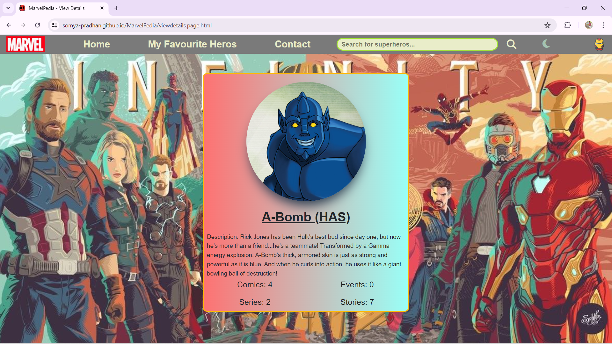

**10. Favourite Superhero Page: `When favourite superhero list is empty` in light mode** 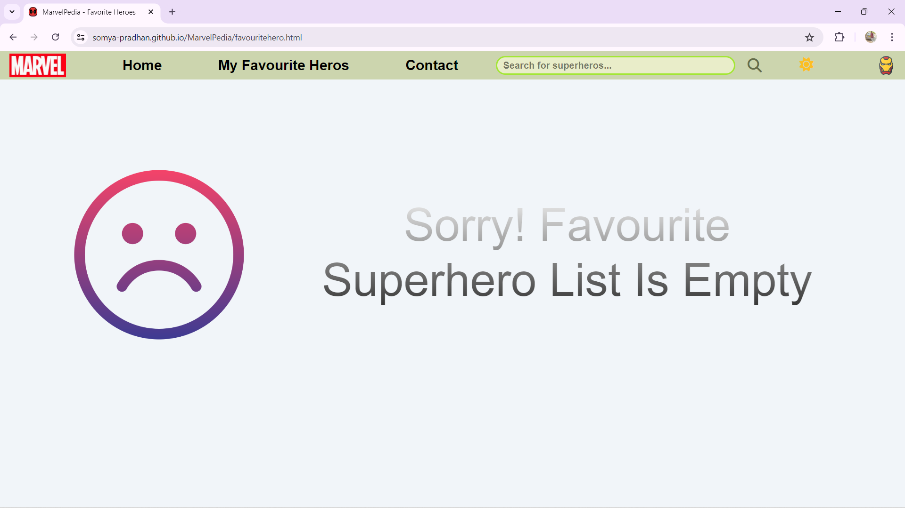

**11. Favourite Superhero Page: `When favourite superhero list is empty` in dark mode** 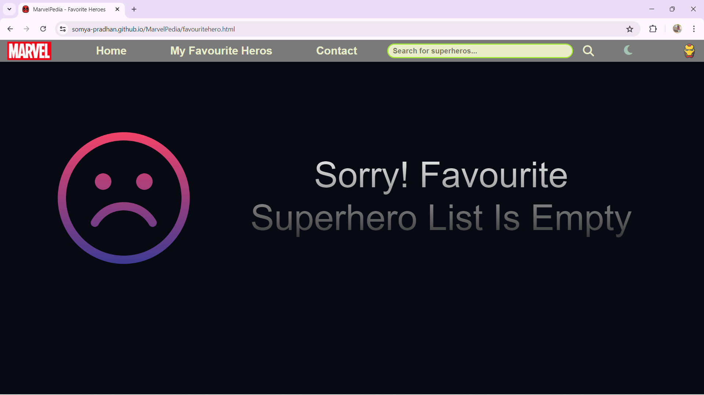

**12. Favourite Superhero Page in Light Mode** 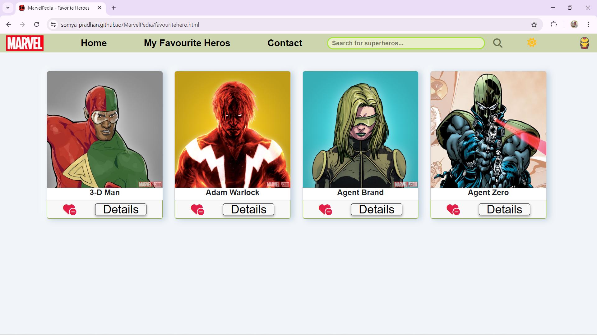

**13. Favourite Superhero Page in Dark Mode** 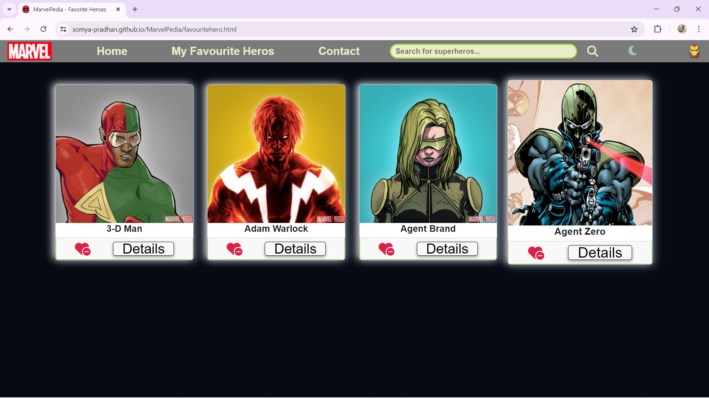

**14. Home Page: Attempting to add a superhero already in the favorites list triggers a popup alerting `Superhero is already added` in light mode** 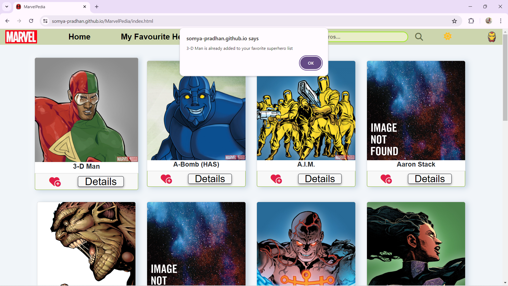

**15. Home Page: Attempting to add a superhero already in the favorites list triggers a popup alerting `Superhero is already added` in dark mode** 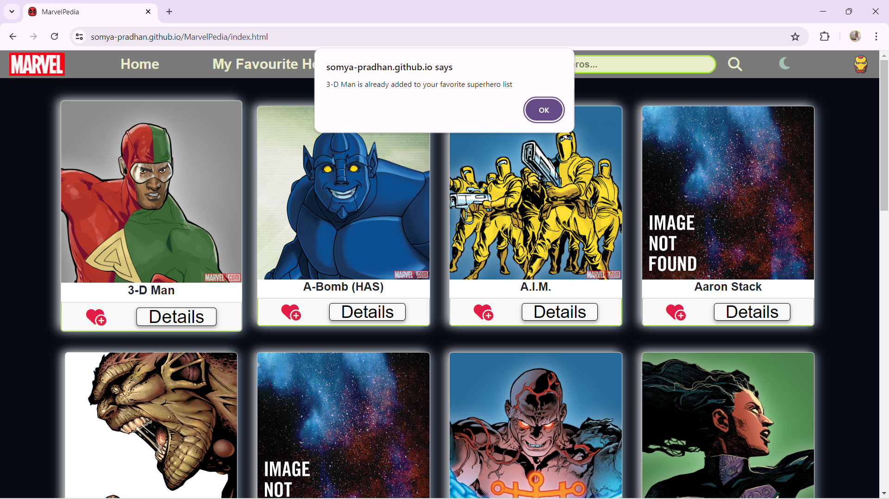

**16. Contacts Page in Light Mode** 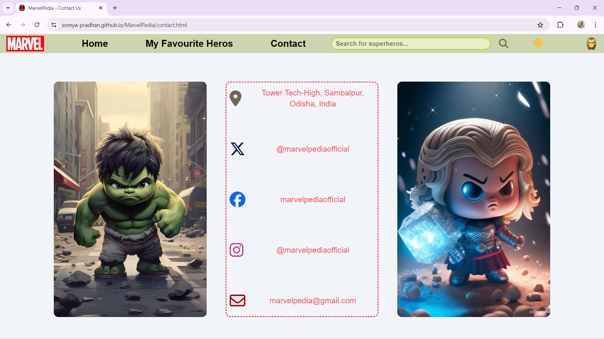

**17. Contacts Page in Dark Mode** 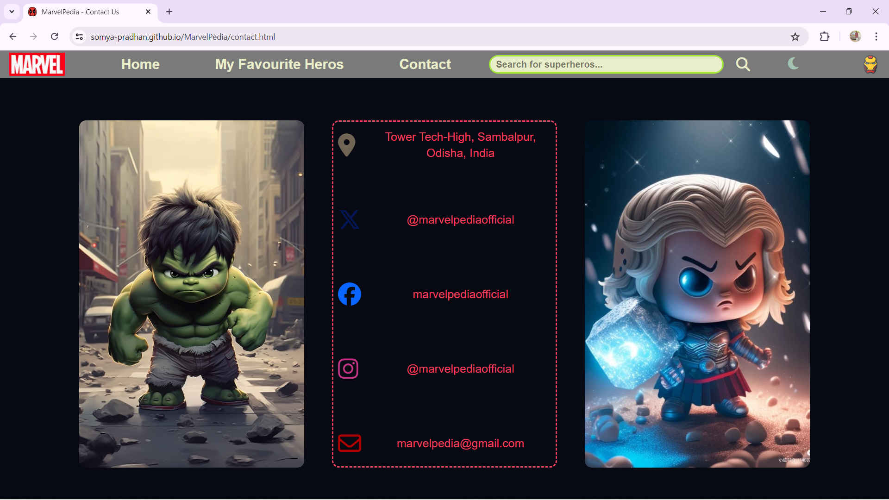
